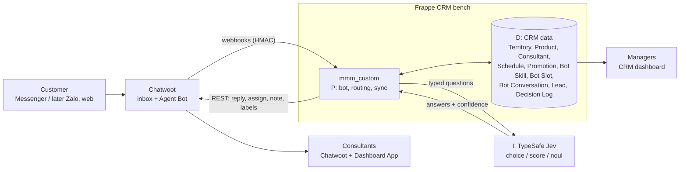
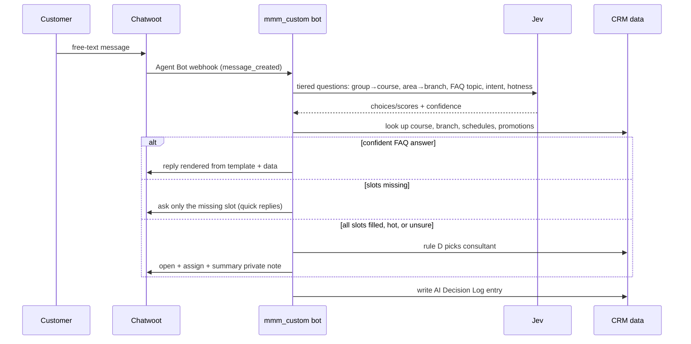
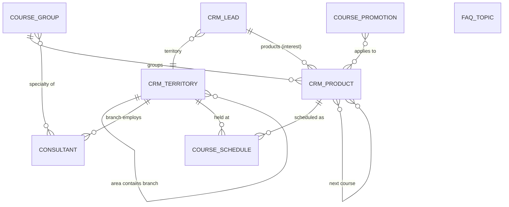
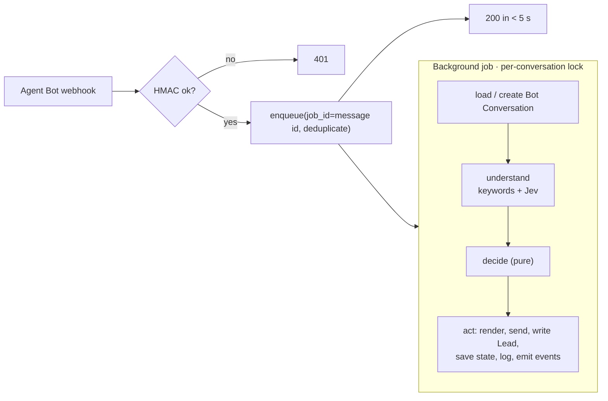

# Edu Lead Engine — Design Spec

_Started: 2026-09-26 · Status: **design in progress** — C1 approved; C2–C3 parts A–B approved, part C pending; C4+ not yet designed · Pilot: Tin Học Sao Việt (demo data)_

## 1. Purpose

Turn DX-OSD from "Messenger messages become CRM Leads" into an education lead engine: every inbound
customer is understood by an AI decision model (TypeSafe Jev), answered from real CRM data, routed to
the right branch and consultant, and followed through to enrolment — with every automated decision
visible to managers and consultants.

This spec is also the roadmap for that work: **10 clusters, 46 layers** (IDs `Cn.m`, D-047), built one layer at a time. It
refines `ROADMAP.md` Phases 4–5 (sales automation, AI assistance) for the education vertical.
Production/ops and multi-tenancy stay in `ROADMAP.md` Phases 1–2 (D-011).

## 2. How this spec is organised

This file is **the spec**. Companion files in
[`2026-09-26-edu-lead-engine/`](2026-09-26-edu-lead-engine/) hold the context it relies on, so design
conversations and implementation read files instead of relying on memory (D-017):

| Companion | Role | Authority |
|---|---|---|
| [`README.md`](2026-09-26-edu-lead-engine/README.md) | Agent briefing: read order, authority, how to write a plan | Entry point |
| [`decisions.md`](2026-09-26-edu-lead-engine/decisions.md) | Every decision, numbered `D-NNN`, with rationale | **Binding.** If this spec and the log disagree, the log wins and this spec is fixed |
| [`current-state.md`](2026-09-26-edu-lead-engine/current-state.md) | Map of today's code (file:line), what is on/off, which layer changes it | Facts; re-verify line numbers |
| [`glossary.md`](2026-09-26-edu-lead-engine/glossary.md) | Terms EN ↔ VI | Reference |
| [`open-questions.md`](2026-09-26-edu-lead-engine/open-questions.md) | Undecided items and unconfirmed assumptions | Working list |

Workflow: a new decision goes into `decisions.md` first, then this spec is updated. A cluster's detailed
design is added to §7 only after it is presented and approved; the layer then moves to 📝.

## 3. Success criteria (program level)

1. A customer writing free text on Messenger ("Robotics cho con 8 tuổi ở Dĩ An, học phí sao?") gets a
   correct, data-backed answer within seconds, or a clean handoff — never an invented fee or schedule.
2. Every lead lands on the right consultant by rule D (branch + specialty + hotness), and the reason is
   recorded.
3. Courses, fees, schedules, branches, consultants and answer wording are changed in the CRM UI with no
   code change or deploy.
4. Managers see the funnel and every automated decision in the CRM; consultants see, beside each
   Chatwoot conversation, what the AI understood and why the conversation is theirs.
5. With no Jev key, or Jev failing, customers are still served (buttons only) and no lead is lost.

## 4. Constraints

- **Stand on giants / extend first.** Reuse Frappe CRM DocTypes (Territory, Product, Lead `territory`
  and `products`, SLA, Task, Deal) and Chatwoot features (Agent Bot, Teams, Dashboard Apps). No edits
  to vendored `crm/` or `chatwoot/` unless no extension point fits — and then recorded in
  `docs/vendored-upstreams.md`.
- **One source of truth.** CRM owns all business data, including consultants (D-015). Chatwoot holds
  conversation state and ids only.
- **Jev is optional.** It is a proprietary hosted API (listed in `THIRD_PARTY_LICENSES.md`); nothing
  may depend on it being available (success criterion 5).
- **Jev never writes text** (D-003). All bot wording comes from Jinja templates filled with CRM data.
- **Security unchanged:** HMAC-verified webhooks with anti-replay, ports on `127.0.0.1`, no secrets in git.
- **Messenger limits:** ≤13 quick replies per message, ≤20 chars per title; outbound messages outside
  the 24h window need a message tag.
- Code, identifiers, docs in English; bot copy in Vietnamese.

## 5. Architecture

### 5.1 System context

### 5.2 Target message flow (detailed in C2/C3)

### 5.3 Degraded mode

No `typesafe_api_key`, Jev timeout or error → the same slot-filling engine runs with buttons only
(tiered: area → branch, group → course), and the decision log records `jev_unavailable`.

### 5.4 H-P-D-I mapping

| Layer | In this program |
|---|---|
| H (Human) | Consultants in Chatwoot, managers in CRM |
| P (Process) | Slot-filling bot, handoff, routing, SLA, follow-ups (`mmm_custom`) |
| D (Data) | CRM DocTypes of C1 + Lead + AI Decision Log |
| I (Intelligence) | Jev: understanding, FAQ choice, hotness/intent, confidence gate |

## 6. Roadmap

### 6.1 Layer-splitting rules (D-009)

1. Each layer delivers a result checkable on the running system, not just "code written".
2. Each layer is size S (≤1 day) or M (2–3 days); bigger is split.
3. Dependencies point one way: a layer only uses earlier layers, so the system works at every stop.
4. External dependencies (Jev, Meta, Zalo) are isolated from internal work.
5. Each cluster ends at a demoable business milestone.

Customer-journey spine: **Attract → Understand → Route → See → Nurture → Close → Widen → Measure → Retain.**
Order rationale: finish the whole journey on one channel (Messenger) before adding channels; data
before AI (Jev can only answer what the data holds); measure only once real data flows.

Status: ⬜ not started · 🖊️ design in progress · 📝 designed · 🔨 in progress · ✅ done (verified on running stacks)

### 6.2 Clusters and layers

**C1 — Data foundation [D]** · milestone: open CRM and see all of Sao Việt · design §7.1
| ID | Layer | Size | Status |
|---|---|---|---|
| C1.1 | Areas → branches on CRM Territory | S | 📝 |
| C1.2 | Course groups → courses on CRM Product (custom fields) | M | 📝 |
| C1.3 | Consultants: branch, specialties, level, B2B flag | M | 📝 |
| C1.4 | Course schedules + promotions | M | 📝 |
| C1.5 | Bot Skills (data) + `Lead Engine Settings` brand/voice + Jinja templates (D-035, D-037) | M | 📝 |
| C1.6 | Sao Việt demo dataset + idempotent loader + Chatwoot agents/teams | M | 📝 |

**C2 — Conversation engine, no Jev yet** · milestone: a Messenger customer is fully served with buttons only, and every step is visible in the Playground · design §7.2
| C2.1 | `Bot Conversation` + async pipeline (enqueue with dedup, per-conversation lock) + event hooks (D-024, D-025, D-036) | M | 🖊️ |
| C2.2 | `Bot Slot` + slot-type registry + diacritic-folded keyword matcher + tiered buttons + exact quick-reply mapping (D-023, D-034) | M | 🖊️ |
| C2.3 | Skill executor: action registry + template rendering with brand context (D-035, D-037) | M | 🖊️ |
| C2.4 | Lead writes (`territory`, `products`, new slot fields) + returning-customer prefill (D-014, D-022) | M | 🖊️ |
| C2.5 | AI Decision Log + learning-signal capture (D-043) | M | 🖊️ |
| C2.6 | Handoff + summary note + Chatwoot labels/conversation attributes + silence rules (D-021, D-026, D-027) | M | 🖊️ |
| C2.7 | Playground: simulate a message, replay a logged decision (D-038) | M | 🖊️ |

**C3 — Jev understanding [I]** · milestone: free-text messages are understood, answered and advised correctly · design §7.2
| C3.1 | Labelled Vietnamese utterance set (~100) + evaluation tool — the gate for going live (D-033) | M | 🖊️ |
| C3.2 | Jev slot understanding: questions generated from data, cross-checks, three bands, confirmation turn (D-028–D-031) | M | 🖊️ |
| C3.3 | Jev skill selection incl. multi-topic fan-out and combined reply (D-039) | M | 🖊️ |
| C3.4 | Intent/hotness/wants-human → early handoff; coordination with `intelligence.py` (D-032) | S | 🖊️ |
| C3.5 | Cost guard + spam stop (D-044) | S | 🖊️ |
| C3.6 | Course advisor: goal/level slots, data filter, composite scoring, top 3 (D-040) | M | 🖊️ |

**C4 — Route to the right person** · milestone: every lead reaches the right consultant, with a reason
| C4.1 | Routing rule D, configurable in CRM (D-006) | M | ⬜ |
| C4.2 | Working hours, holidays, away status + out-of-hours bot behaviour (D-046) | M | ⬜ |
| C4.3 | Reassign when a consultant misses the response deadline | M | ⬜ |
| C4.4 | B2B lead detection → B2B team (D-012) | M | ⬜ |

**C5 — Visibility** · milestone: managers and consultants see the automation
| C5.1 | CRM dashboard: funnel + charts by course/branch/consultant | M | ⬜ |
| C5.2 | Decision log browser page | S | ⬜ |
| C5.3 | Chatwoot Dashboard App, read-only: what AI understood, why assigned | M | ⬜ |
| C5.4 | Chatwoot Dashboard App, actions: matching schedules/fees, insert into reply | M | ⬜ |
| C5.5 | Course cards (image + buttons) on Messenger — vendored Chatwoot edit (D-041) | M | ⬜ |

**C6 — No lead left behind** · milestone: no lead goes overdue unnoticed
| C6.1 | Lead statuses for a training centre + lost reasons | S | ⬜ |
| C6.2 | First-response SLA + manager alert (CRM SLA) | S | ⬜ |
| C6.3 | Consultation/trial appointments + date/time understanding + reminders (D-042) | M | ⬜ |
| C6.4 | Course-aware re-engagement, 24h-window aware (upgrade `followup.py`) | M | ⬜ |
| C6.5 | Unified lead score | M | ⬜ |

**C7 — Close the enrolment** · milestone: from chat to enrolment with fee
| C7.1 | Lead → Deal: enrol course, fee, promotion | M | ⬜ |
| C7.2 | Duplicate merge proposals, human-approved (never auto-merge) | M | ⬜ |

**C8 — More lead sources**
| C8.1 | Facebook Lead Ads per-course forms into the same pipeline | M | ⬜ |
| C8.2 | Website chat widget + form | S | ⬜ |
| C8.3 | Zalo OA (depends on Zalo approval) | M | ⬜ |

**C9 — Measure & improve**
| C9.1 | Consultant/branch performance | M | ⬜ |
| C9.2 | AI quality dashboard + learning review: approve alias proposals, promote examples to the eval set (D-043) | M | ⬜ |
| C9.3 | A/B template variants with conversion measurement (D-045) | M | ⬜ |
| C9.4 | Ad → enrolment attribution, cost per lead (Meta Marketing API) | M | ⬜ |

**C10 — After enrolment** (direction only; designed when reached)
| C10.1 | Class schedule reminders | — | ⬜ |
| C10.2 | Satisfaction survey | — | ⬜ |
| C10.3 | Referrals | — | ⬜ |
| C10.4 | Next-course suggestion along learning paths | — | ⬜ |

### 6.3 Old layer numbers (before D-047)

Decisions D-001…D-046 may cite the old 1–39 numbers: 1–6 → C1.1–C1.6 · 7 → C2.1/C2.2/C2.4 · 8 → C2.3 ·
9 → C2.5 · 10 → C2.6 · 11 → C3.1 · 12 → C3.2 · 13 → C3.3 · 14 → C3.4 · 15–18 → C4.1–C4.4 ·
19–22 → C5.1–C5.4 · 23–27 → C6.1–C6.5 · 28–29 → C7.1–C7.2 · 30–32 → C8.1–C8.3 · 33 → C9.1 ·
34 → C9.2 · 35 → C9.4 · 36–39 → C10.1–C10.4.

## 7. Cluster designs

### 7.1 C1 — Data foundation (approved 2026-09-26, D-013…D-016)

#### Data model

Standard DocTypes extended with Custom Fields (created in `setup.py` + a patch, like today's fields):

| DocType | Custom fields |
|---|---|
| CRM Territory | `branch_code` (Data, unique), `address` (Small Text), `hotline` (Data), `map_url` (Data), `aliases` (Small Text, comma-separated: "Dĩ An, Di An") |
| CRM Product (= course) | `course_group` (Link Course Group), `audience` (Select: Trẻ em / Học sinh – Sinh viên / Người đi làm / Doanh nghiệp), `min_age`, `max_age` (Int), `duration_text` (Data, "1–2 tháng"), `certificate` (Data), `aliases` (Small Text), `next_courses` (Table MultiSelect → course), `is_demo_data` (Check). `standard_rate` = listed fee |

New DocTypes in `mmm_custom` (module *Mmm Custom*), editable at `/app/<doctype>`:

| DocType | Fields |
|---|---|
| **Course Group** | `group_name` (name), `emoji`, `sort_order`, `aliases`, `description` |
| **Consultant** | `user` (Link User, unique), `full_name` (fetched), `chatwoot_agent_id` (Int), `branch` (Link CRM Territory, leaf only; empty = central team), `level` (Select: Team Lead / Consultant), `specialties` (Table MultiSelect → Course Group), `handles_b2b` (Check), `active` (Check) |
| **Course Schedule** | `course` (Link CRM Product), `branch` (Link CRM Territory), `start_date` (Date), `shift` (Select: Sáng 8:30–11:00 / Chiều 13:30–16:30 / Tối 17:00–21:00), `weekdays` (Data, "T2, T4, T6"), `seats` (Int), `status` (Select: Open / Full / Started), `is_demo_data` |
| **Course Promotion** | `title`, `discount_type` (Percent / Amount), `discount_value`, `valid_from`, `valid_to`, `courses`, `course_groups`, `branches` (Table MultiSelect each; empty = all), `active`, `is_demo_data` |

`FAQ Topic` was replaced by **`Bot Skill`** (D-035); `Bot Skill` and the single DocType
`Lead Engine Settings` (brand/voice, D-037) are created as data in C1.5 but specified with the engine in
§7.2 part C, which must be approved before C1 is planned.

Rules:
- Aliases on branches, groups and courses are read by both button matching and Jev criteria.
- Templates render with `frappe.render_template`; the context contract (course, branch, next open
  schedules, active promotions, brand) is fixed in C2.3. Only System Manager may edit Bot Skills.
- C1 **adds only**. `api.py`, `bot_api.py` and Activepieces keep writing `branch`/`course_interest`
  until C2.4 switches to `territory`/`products` (D-014); existing dev leads are mapped where a
  branch matches, otherwise left as is.

#### Demo dataset (C1.6, D-005)

| Data | Count | Source |
|---|---|---|
| Areas / branches | 4 / 13 | **Real** (tinhocsaoviet.com, with addresses) |
| Course groups / courses | 8 / ~45 | **Real names**: Tin học văn phòng, Đồ họa, Vẽ kỹ thuật, Kế toán, Lập trình, Tin học trẻ em (+ Robotics), Digital Marketing, AI & Automation |
| Fees, durations | ~45 | Invented, `is_demo_data = 1` |
| Consultants | ~45 (3 per branch + B2B team + central team) | Invented, non-routable demo email domain |
| Schedules | ~400 (next 8 weeks) | Generated deterministically from per-course branch offerings |
| Promotions / Bot Skills | ~10 / ~30 | Invented; copy built on real selling points ("học không giới hạn buổi đến khi thành thạo", certificate lookup at `chungnhan.tinhocsaoviet.com`) |

Loader: JSON files under `mmm_custom/demo/saoviet/`, run with
`bench --site crm.localhost execute mmm_custom.demo.loader.load`. It upserts by natural key
(`territory_name`, `group_name`, `product_code`, consultant `user`, schedule
course+branch+date+shift, promotion `title`, skill key), so re-running changes nothing, and it can
purge rows with `is_demo_data`. A companion script creates the Chatwoot side: one agent per consultant,
one Team per branch plus B2B and central teams, inbox membership, and writes `chatwoot_agent_id` back to
the Consultant. It supersedes `scripts/seed-branch-agents.py`.

#### C1 verification

- Unit tests for the loader's upsert/idempotency and the deterministic schedule generator.
- On a fresh `-p crmverify` bench: `bench migrate` succeeds; loader run twice gives identical counts
  (4 areas, 13 branches, 8 groups, ~45 courses, ~45 consultants, ~400 schedules); Chatwoot shows the
  15 teams with their agents.
- Existing suites still pass: `python -m unittest discover -s frappe-custom/mmm_custom/mmm_custom/tests`
  and `scripts/test-chatwoot-crm-sync.py` (5/5).

### 7.2 C2 + C3 — Conversation engine and Jev understanding (parts A–B approved 2026-09-26; part C pending)

#### Part A — Conversation engine (D-023…D-027, D-034, D-036)

**Slots are data.** `Bot Slot` rows define what the bot asks: `slot_key`, `label`, `slot_type`,
`required`, `sort_order`, `ask_template` (Jinja), `options` (child table, each option with aliases),
`depends_on` (slot + value), `lead_field` (where the value is written on the Lead). A new question is a
row. Slot types are a small code registry — a new kind of answer is one handler:

| `slot_type` | Understood by | Buttons |
|---|---|---|
| `catalog` | C1 catalog aliases, tiered | group → course, area → branch |
| `choice` | `options` + aliases | the options |
| `phone` | Vietnamese phone regex (`bot_engine._normalize_vn_phone`) | "Bỏ qua" if not required |
| `number` | number in the text (e.g. age) | — |
| `text` | the message itself (e.g. name) | — |

Initial rows: `course`★, `branch`★, `phone`★, `learner` (self / child / company staff), `learner_age`
(only if learner = child), `preferred_shift`, `customer_name`; C3.6 adds `goal`, `level`. ★ = required.

**State per conversation.** `Bot Conversation` (one per Chatwoot conversation): `conversation_id`
(unique), `contact_id`, `lead`, `status` (active / handed_off / closed), `slots` (JSON: value, source =
button / keyword / jev / lead, confidence), `pending` (JSON: the question or confirmation being asked
and the offered options title → value, D-034), `last_message_id`, `consultant_replied` (Check). A
returning customer's new conversation is prefilled from the Lead (D-022).

**Pipeline.**

`decide(conversation, understanding, catalog, settings)` is a pure function returning one of: answer
skill(s) · ask confirmation · ask next missing slot · hand off · stay silent. After handoff the bot answers
skills only until the consultant's first message, then stays silent (D-026).

**Events (D-036).** The job emits `slot_filled`, `skill_done`, `handed_off`, `lead_updated` to handlers
registered under the `lead_engine_events` hook in any app's `hooks.py`.

**Chatwoot natively (D-027).** Labels for course group, branch, hotness; branch Teams for assignment;
conversation `custom_attributes` mirror the filled slots in the Chatwoot sidebar.

#### Part B — Jev understanding (D-028…D-033)

1. **Button tap** → exact value from `pending` options; no Jev.
2. **Keyword tier** (always): diacritic-folded text matched against catalog aliases, slot options,
   phone and number regexes. Unique match → candidate with source `keyword`; several matches → a
   candidate set.
3. **Jev tier** (if enabled and not blocked by the cost guard): one call, parallel questions
   generated from data, only for what is still open — course group, course, area, branch, open
   `choice` slots, skills (C3.3), intent and hotness (reused from `intelligence.py`), wants-human
   `noul`. State: latest message, ~10 recent turns, known slots, the bot's pending question. Criteria in
   English with Vietnamese aliases. Timeout 8 s; failure → keyword tier only, logged `jev_unavailable`.

**Combination (D-029).** Unique keyword match wins unless Jev confidently picks another value (→
confirm). Ambiguous keyword → Jev picks among the candidates, else buttons limited to them. Course
outside the chosen group, or branch outside the chosen area → drop the child, keep the parent if confident.

**Three bands (D-030)**, thresholds in `Lead Engine Settings`, starting values tuned by C3.1:

| Decision | Act ≥ | Confirm ≥ | Below |
|---|---|---|---|
| Fill catalog slot | 0.85 | 0.55 | buttons |
| Fill choice slot | 0.80 | 0.50 | ask |
| Answer a skill | 0.85 | 0.60 ("Bạn muốn hỏi về học phí phải không ạ?") | skip, continue slots |
| Early handoff (wants human / hot) | noul 0.70 | — | — |

Confirmation turn: [Đúng ạ] [Không phải], stored in `pending`; "Không phải" → buttons for that slot.

**No double spend (D-032).** While a Bot Conversation is active, `intelligence.analyze_conversation`
skips it; after handoff it runs as today.

**Go-live gate (D-033).** ~100 labelled hard Vietnamese utterances (no diacritics, abbreviations,
multi-slot, negation, spam, B2B, short answers to the pending question) + an evaluation tool against
real Jev: per-question accuracy by band and count of wrong answers in the act band. Jev serves real
customers only with 0 wrong course/branch/skill answers in the act band. The keyword tier is
unit-tested offline.

#### Part C — Skills, replies, advisor, log, handoff, playground, cost guard

Pending design. Scope fixed by D-035, D-037…D-040, D-043, D-044.
