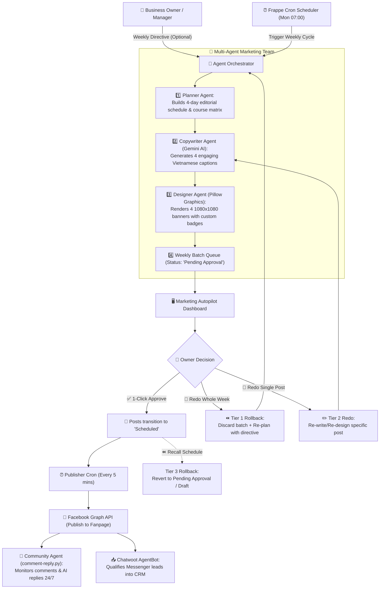

# Specification: Autonomous Marketing Multi-Agent System (EduFlow Autopilot)

**Document:** `docs/superpowers/specs/2026-09-27-autonomous-marketing-agent-design.md`  
**Date:** 2026-09-27  
**Author:** AI Agent & Human Partner  
**Status:** In Review  
**Project:** DX-OSD (EduFlow Marketing Platform)  
**License:** 100% OSI-approved FOSS (MIT / AGPLv3)

---

## 1. Executive Summary & Problem Statement

Currently in DX-OSD, creating and publishing promotional content on Facebook is manual and reactive:
- A user must navigate to the `Facebook Post` DocType, pick a course, manually trigger AI content generation, trigger banner generation, set a scheduled time, and click post or schedule.
- Although individual AI writing and graphic rendering functions exist, there is no autonomous planning or coordination.

This specification introduces the **Autonomous Marketing Multi-Agent System (EduFlow Autopilot)**:
1. **Multi-Agent Architecture**: A coordinated team of specialized agents (Planner, Copywriter, Designer, Publisher, and Community Manager) working together without human friction.
2. **Weekly Batch Cadence**: At the start of each week (Monday 07:00 or on-demand trigger), the Planner Agent analyzes the content matrix, balances course promotion across the week, and prepares a batch of 4 ready-to-publish posts (Captions + Banners + Golden Hour Schedules).
3. **Copilot Mode (1-Click Approval)**: Generated posts are placed into `Pending Approval` status. The business owner reviews the entire week in under 30 seconds on a dedicated visual dashboard and approves the batch with a single click.
4. **3-Tier Rollback & Regeneration Engine**: If the owner is unsatisfied with any aspect:
   - **Tier 1 (Full Week Redo)**: Rollback and regenerate the entire weekly batch with a custom boss directive.
   - **Tier 2 (Single Card Redo)**: Regenerate a specific post's caption or banner with custom feedback while preserving the rest of the batch.
   - **Tier 3 (Recall Schedule)**: Withdraw scheduled posts back to draft/pending before they are published to Facebook.

---

## 2. Multi-Agent Roles & Interaction Architecture



### Agent Roles:
1. **Orchestrator Agent**:
   - Manages batch lifecycle: creation, validation, regeneration, and status transitions.
   - Assigns a unique `batch_id` (e.g., `BATCH-2026-W39`) to group the week's posts.
2. **Planner Agent**:
   - Evaluates the standard weekly distribution:
     - **Monday 08:30**: English Communication (`Tiếng Anh`) — Focus: Start-of-week motivation, practical communication for kids/adults.
     - **Wednesday 11:30**: Critical Math (`Toán tư duy`) — Focus: Logic development, brain training, problem-solving.
     - **Friday 19:30**: Swimming (`Bơi lội`) — Focus: Life survival skills, weekend sports activities, health.
     - **Sunday 09:00**: General Enrollment / Family Day (`Chung`) — Focus: Summer scholarships, open day tours, parent testimonials.
   - Applies the **Boss Directive** if provided (e.g., "Ưu đãi 50% bơi lội tuần này").
3. **Copywriter Agent**:
   - Calls Gemini 3.8 Flash with structured guidelines (under 150 words, Vietnamese, emojis, 3 benefits bullets, 3 campuses CS1 Bình Thạnh, CS2 Q1, CS3 Thủ Đức, hotline 0901.888.666, call to action, clean plain text without markdown asterisks).
4. **Designer Agent**:
   - Calls Pillow engine to generate branded 1080x1080 banners with dynamic course theme colors, hero imagery, promo badge (derived from directive or course defaults), benefits checklist, CTA button, and 3-campus footer.
5. **Publisher Agent**:
   - Background worker running via Frappe scheduler. Checks for posts in `Scheduled` status whose `scheduled_time <= now_datetime()` and invokes `post_now()`.
6. **Community & Lead Agents**:
   - `comment-reply.py` daemon monitors Facebook post comments and auto-replies using Gemini AI.
   - Chatwoot webhook handles inbound Messenger conversations, runs the qualification state machine, and syncs Leads to Frappe CRM.

---

## 3. Data Schema & Model Updates

### 3.1 Extensions to `Facebook Post` DocType
Add the following fields to `Facebook Post`:
| Fieldname | Fieldtype | Options / Default | Description |
|---|---|---|---|
| `status` | Select | `Draft\nPending Approval\nScheduled\nPosted\nFailed\nCancelled` | Updated to include `Pending Approval` |
| `batch_id` | Data | | Groups posts created in the same weekly batch (e.g. `BATCH-2026-W39`) |
| `boss_directive` | Small Text | | Strategic instruction from user applied to this post |
| `day_of_week` | Select | `Thứ Hai\nThứ Ba\nThứ Tư\nThứ Năm\nThứ Sáu\nThứ Bảy\nChủ Nhật` | Planned weekday for display on dashboard |

### 3.2 Single DocType: `Marketing Agent Settings`
A configuration singleton to manage autopilot settings:
| Fieldname | Fieldtype | Default | Description |
|---|---|---|---|
| `enabled` | Check | 1 | Enable/disable autonomous weekly scheduling |
| `require_approval` | Check | 1 | 1 = Copilot (requires 1-click approval), 0 = Full Hands-free |
| `plan_day` | Select | `Monday` | Day of week to generate next batch |
| `plan_time` | Time | `07:00:00` | Time of day to run the planner |
| `current_directive` | Small Text | | Active strategic directive for the upcoming/current week |
| `last_planned_batch` | Data | | Last generated batch ID |
| `last_planned_at` | Datetime | | Timestamp when planner last ran |

---

## 4. 3-Tier Rollback & Regeneration Specifications

### Tier 1: Full-Week Rollback & Regeneration (`regenerate_weekly_batch`)
- **Trigger**: User clicks `🔄 Yêu cầu Agent làm lại cả tuần` on the Dashboard.
- **Input**: User provides feedback/directive (e.g. "Đổi tông giọng hào hứng hơn, nhấn mạnh học thử miễn phí").
- **Action**:
  1. Locates all posts with `batch_id == current_batch_id` and `status == "Pending Approval"`.
  2. Deletes or marks old posts as `Cancelled`.
  3. Updates `Marketing Agent Settings.current_directive` with the new input.
  4. Triggers `generate_weekly_batch(directive=...)` immediately.
  5. Refreshes the dashboard to display the new 4-post set.

### Tier 2: Single-Post Regeneration (`regenerate_single_post`)
- **Trigger**: User clicks `🔄 Làm lại bài này` on any post card.
- **Input**: User provides post-specific instructions (e.g. "Tặng balo cho khóa bơi lội").
- **Action**:
  1. Invokes `generate_ai_content(user_feedback=feedback)` on the target post.
  2. Invokes `generate_banner(user_feedback=feedback)` on the target post.
  3. Updates the target post's `ai_feedback`.
  4. Preserves all other posts in the batch intact.

### Tier 3: Schedule Recall (`recall_schedule`)
- **Trigger**: User clicks `⏪ Thu hồi lịch đăng` (either for the batch or individual post).
- **Condition**: Post status is `Scheduled` and not yet `Posted`.
- **Action**:
  1. Reverts `status` from `Scheduled` back to `Pending Approval` (or `Draft`).
  2. Prevents the Publisher Agent from pushing the post to Facebook when the time arrives.
  3. Displays an alert confirmation: "Đã thu hồi lịch đăng bài an toàn."

---

## 5. User Interface: Marketing Autopilot Dashboard

### Layout & Components
1. **Header & Control Bar**:
   - Status badge: `🤖 Agent Autopilot: Hoạt động`
   - Active Batch indicator: `Tuần 39 (29/09 - 05/10/2026)`
   - Primary action button: `✅ Duyệt tất cả tuần này` (Green, prominent)
   - Secondary action button: `🔄 Yêu cầu làm lại cả tuần` (Outline warning)
   - Quick Planner trigger: `⚡ Lên kế hoạch ngay` (For on-demand batch creation)
2. **Boss Directive Banner**:
   - Shows current strategic instruction with an `✏️ Đổi chỉ đạo` button.
3. **Weekly Grid (4 Cards)**:
   - **Card 1: Thứ Hai - 08:30 (Tiếng Anh)**
   - **Card 2: Thứ Tư - 11:30 (Toán tư duy)**
   - **Card 3: Thứ Sáu - 19:30 (Bơi lội)**
   - **Card 4: Chủ Nhật - 09:00 (Tuyển sinh chung)**
   - Each card displays:
     - Course badge with matching color.
     - Scheduled publishing time.
     - Status tag (`Pending Approval`, `Scheduled`, `Posted`).
     - Banner thumbnail (click to expand).
     - Caption excerpt (with expand/collapse).
     - Per-card actions: `🔄 Làm lại bài`, `✏️ Chỉnh sửa`, `🚀 Đăng ngay`.

---

## 6. Background Automation & Scheduler Integration

In `frappe-custom/mmm_custom/mmm_custom/hooks.py`:

```python
scheduler_events = {
    "cron": {
        # Existing daily follow-up task at 08:00
        "0 8 * * *": ["mmm_custom.followup.run_daily"],
        # Autopilot Planner: Runs every Monday at 07:00
        "0 7 * * 1": ["mmm_custom.autopilot.run_weekly_planner"],
        # Autopilot Publisher: Checks every 5 minutes for scheduled posts to publish
        "*/5 * * * *": ["mmm_custom.autopilot.publish_scheduled_posts"],
    },
}
```

- **Idempotency**: `publish_scheduled_posts` acquires a database lock or checks `status == "Scheduled" and scheduled_time <= now_datetime()` to ensure no post is published twice.
- **Fault Tolerance**: If publishing fails (e.g. temporary network error), status becomes `Failed`, `error_message` is logged, and a Frappe Notification is sent to system administrators without crashing the scheduler.

---

## 7. Verification & Test Plan

1. **Unit Tests (`test_autopilot.py`)**:
   - `test_generate_weekly_batch_creates_4_posts`: Verifies batch creates 4 posts with correct days, courses, and golden hours.
   - `test_batch_applies_boss_directive`: Verifies directive text is injected into captions and promo badges.
   - `test_approve_batch`: Verifies 1-click approve transitions all pending posts to `Scheduled`.
   - `test_tier1_rollback_regenerate`: Verifies old batch is superseded and new batch created with updated feedback.
   - `test_tier2_single_post_redo`: Verifies only target post is modified.
   - `test_tier3_recall_schedule`: Verifies scheduled post is reverted to `Pending Approval`.
   - `test_publish_scheduled_posts_job`: Verifies cron runner publishes due posts and leaves future posts intact.
2. **Integration Verification**:
   - Run `python -m unittest discover -s frappe-custom/mmm_custom/mmm_custom/tests -v`.
   - Clear cache on live bench: `bench --site crm.localhost clear-cache`.
   - Migrate doctype: `bench --site crm.localhost migrate`.
   - Manually trigger `run_weekly_planner` via API and verify the 4 posts appear on the CRM Dashboard.

---

## 8. FOSS Compliance & Resource Constraints
- 100% OSI-approved FOSS licenses (MIT, AGPLv3).
- Uses Pillow and Gemini API (already pinned and licensed).
- Bound strictly to `127.0.0.1`.
- Persistent Docker database state preserved.
